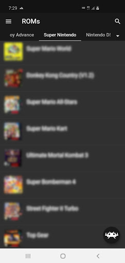
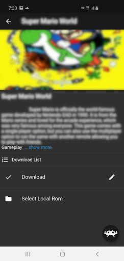
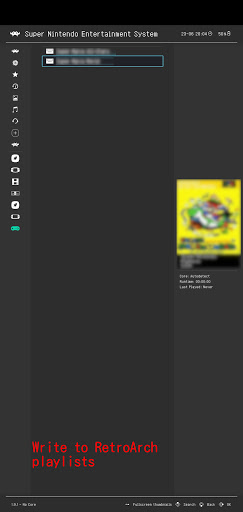

# retroconfig

Download ROMs and write RetroArch playlists. This app is published on [GooglePlay](https://play.google.com/store/apps/details?id=com.ero.retroconfig)

## Description

- Manage plugins with Git.
- Download ROMs with provided by the plugin.
- Write the ROM infomation to RetroArch playlist.

